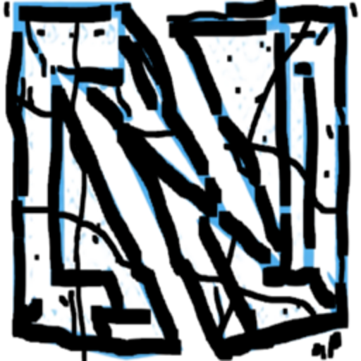

  
  

This repo is for assets in dev, stuff i use for games, and for permalinks. and also a lot of the content inside of [this](https://github.com/nnapkin12/napkin-theme-assets/tree/main/Kirka%Map%20Textures), and some of [these](https://github.com/nnapkin12/napkin-theme-assets/tree/main/Kirka%Scripts), are copied from discord, and other websites.

## [GTA V Related/Mods](https://github.com/nnapkin12/napkin-theme-assets/blob/main/GTA%20V/GTAVstuff.md)

## [Miscellaneous stuff](https://github.com/nnapkin12/napkin-theme-assets/tree/main/misc)

[Inventory Price Scanner](https://github.com/nnapkin12/napkin-theme-assets/blob/main/Scripts/InventoryPriceScanner.js): From an existing inventory pricing script, i just extended it to have a menu(ctrl+K), with metadata for each item it picks up, aswell as a catalog of all skins to view all of their information.

  

[FPS/Ping Display](https://github.com/nnapkin12/napkin-theme-assets/blob/main/Scripts/FPS-MS-OnScreen.js):

Gives a new look and places FPS/Ping on the bottom right, it uses the already existing fps/ping readouts from kirka, you dont need the kirka HUD on, this script auto reads it.

  

[Weapon Animations+Weapon Scale/Position Modifier](https://github.com/nnapkin12/napkin-theme-assets/blob/main/Scripts/GunScaleAndAnim.js):
**Ctrl+O** to toggle menu. Made this from existing Gun scale Mod scripts, and added 3 custom weapon animations: **spin clockwise**, a **cowboy-esc twirl**, and experiemntal nudge out+clockwise(not that smooth). you can swap these animations for each gun, aswell as a knife butterfly/spin animation(which is hardcoded to only toma/bayonet) you can change the keybind for animations aswell, and they go through kirka, so i could bind it to my reload keybind and it still works. **Ctrl+O** to toggle menu

  

[Custom Head/Body Color](https://github.com/nnapkin12/napkin-theme-assets/blob/main/Scripts/Custom-Player-Color.js):
Create a custom head and body color for your charecter. At the top of the script, edit the two hex values, labeled head and body.

  

[Kirka Skin DB](https://github.com/nnapkin12/napkin-theme-assets/blob/main/misc/skins.json):
Kirka Skin database i update from time to time. useful for asset scripts, CSS previewing skins etc.| contains hashes, texture webps, render webps fallback to https://kirka.lukeskywalk.com . Skin sets organized aswell.
